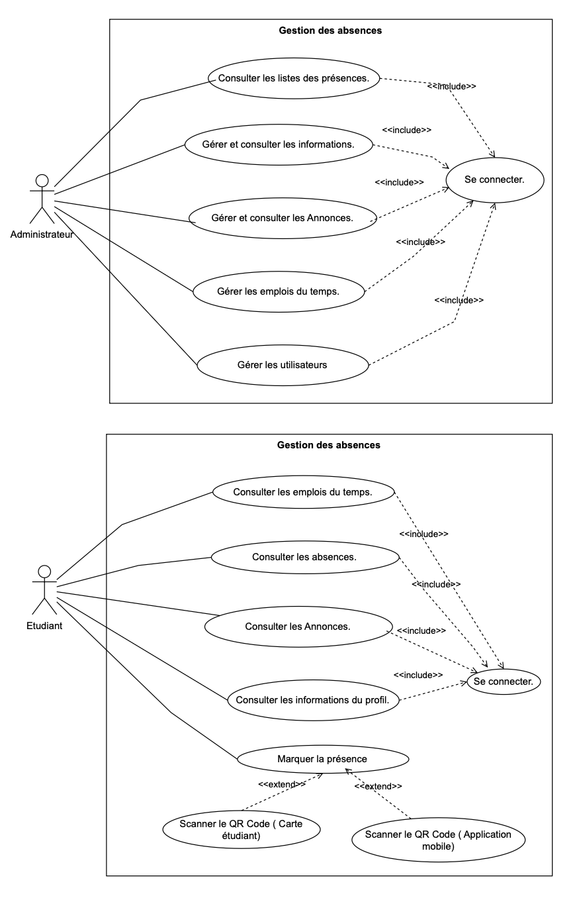

# 🎓 Système intelligent de gestion des absences - AbsENS


---
## Architecture du dossier
```bash

app
   |-mobile (android)
   |-web    (Laravel)
   |-Système électronique

```
---

## 📌 Présentation

Ce projet de stage a pour objectif la **conception et la mise en œuvre d’un système intelligent de gestion des absences**, destiné à un établissement universitaire comme l'ENS Marrakech.

Le système est basé sur une **architecture modulaire** et intègre des composants Web, Mobile, et Embarqué (Raspberry Pi) pour automatiser la détection, le contrôle et le suivi des absences.

---

## 🧠 Fonctionnalités principales

- Authentification sécurisée multi-profils (Admin, Professeur, Étudiant)
- Scan de QR Code avec caméra Raspberry Pi
- Détection des entrées via OpenCV
- Tableau de bord centralisé des présences
- Export PDF, statistiques, calendrier
- Application mobile Android pour les étudiants

---

## 🧰 Technologies utilisées

| Catégorie        | Technologies                                                                 |
|------------------|------------------------------------------------------------------------------|
| Backend          | Laravel 10, MySQL, API REST avec Sanctum                                    |
| Frontend         | Blade, Bootstrap 5, FullCalendar, Chart.js                                  |
| Mobile           | Android Studio, Java, Retrofit                                               |
| Embarqué         | Raspberry Pi, Python, OpenCV                                                 |
| Outils Dev       | GitHub, Docker, VS Code, Notion, Discord                                     |
| Librairies clés  | Spatie Roles & Permissions, DomPDF, Bootstrap Icons                         |


---

## 📊 Diagrammes UML

### 🔹 Cas d’utilisation (Use Case)




### 🔹 Diagramme de calsse


<!-- ### 🔹 Architecture globale -->

<!--  -->

---

## 👨‍🏫 Références académiques

- **Étudiant** : AIT ICHOU Rafik  
- **Encadrant** : Pr. NAIT MALEK Youssef (ENS Marrakech)  
- **Établissements** :

  <a href="https://emsi.ma/"> EMSI Marrakech </a>
  <a href="https://ens.uca.ma/"> ENS Marrakech </a>
  

---

## 📬 Contact

Pour toute question, vous pouvez me contacter :

**Email** : a.ichou.rafik@gmail.com  


